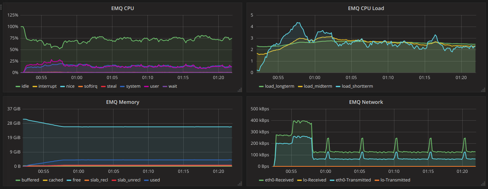
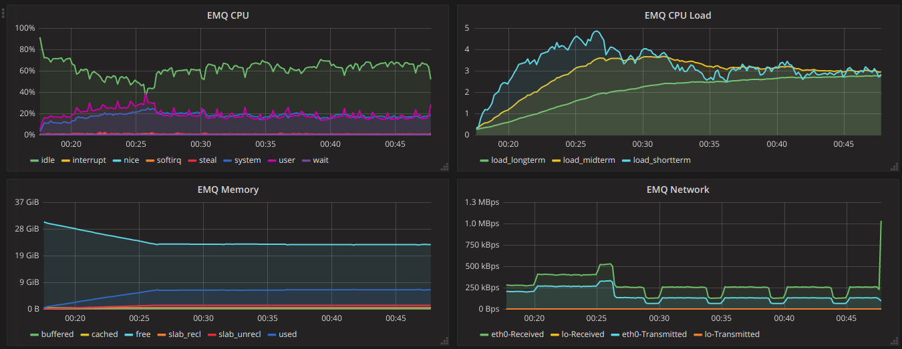
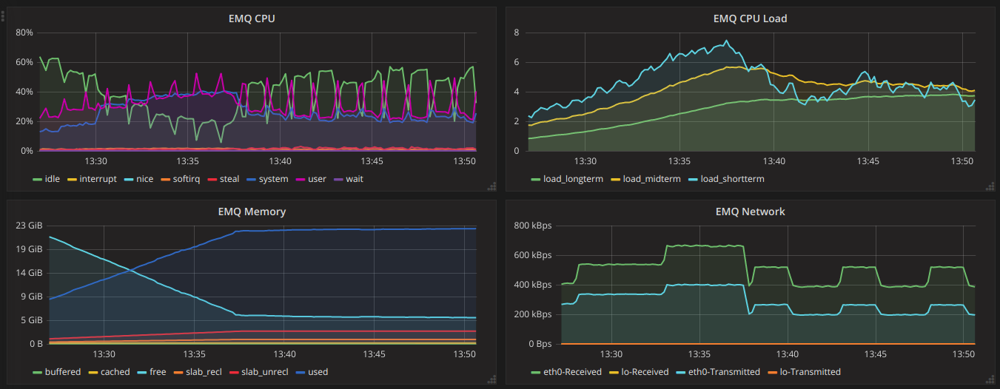
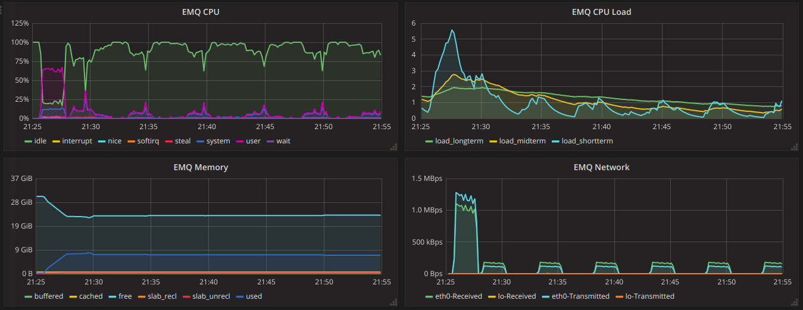
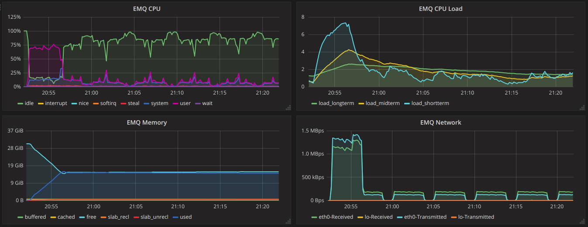
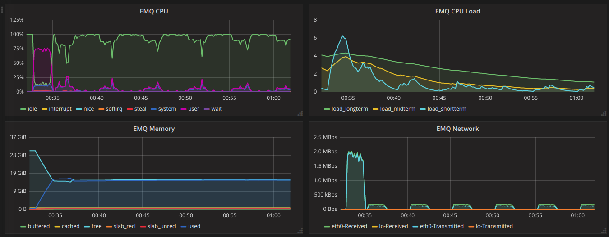
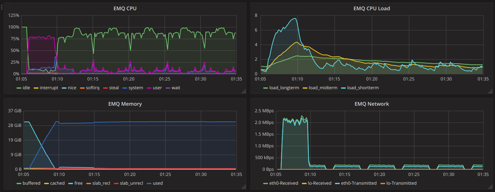

.. _connection_benchmark:

==========================
Concurrent connection test
==========================

The test scenario test the MQTT connection between client and server side, the clients don't send out any data except MQTT control and ping packet. The purpose of test is to get EMQ performance data under different connection numbers.

--------------
TCP Connection
--------------

Overall: The response time is less than 8ms within 1 million connection, successful rate is 100%. Memory usage is in line with increasing of connections. CPU usage is stable, but observed surge of CPU usage when connections are disconnectd.

.. NOTE:: Test agent configuration：1 VM runs 50000 VU (2 dockers*25000 VU)

300k conn
---------

+---------------------+-----------------+---------------------+--------------------+-----------------------+-------------------+-------------------+-----------------+
| Virtual user number | Conn per second | Test duration (Sec) | Average throughput | Average response time | Max response time | Min response time | Sussessful rate |
+=====================+=================+=====================+====================+=======================+===================+===================+=================+
|    300000           |        1000     |         1800        |     909            |     8ms               |     3.143s        |    1ms            | 100%            |
+---------------------+-----------------+---------------------+--------------------+-----------------------+-------------------+-------------------+-----------------+

+--------------------------------+--------------------------+-------------------------------------------------------------------+
|     CPU Load                   |      CPU usage           |                   Memory                                          |
+================================+==========================+===================================================================+
| CPU shortterm load reaches 4   | CPU usage between 5%-26% |  Memory grows with increasing of connections, max value is 4.9GB. |
+--------------------------------+--------------------------+-------------------------------------------------------------------+

EMQX Server Monitor

500k conn
---------

+---------------------+-----------------+---------------------+--------------------+-----------------------+-------------------+-------------------+-----------------+
| Virtual user number | Conn per second | Test duration (Sec) | Average throughput | Average response time | Max response time | Min response time | Sussessful rate |
+=====================+=================+=====================+====================+=======================+===================+===================+=================+
|      500000         |    1000         |         1800        |      943           |       7ms             |     2.460s         |     1ms           |       100%      |
+---------------------+-----------------+---------------------+--------------------+-----------------------+-------------------+-------------------+-----------------+

+--------------------------------+--------------------------+-------------------------------------------------------------------+
|     CPU Load                   |      CPU usage           |                   Memory                                          |
+================================+==========================+===================================================================+
| CPU shortterm load reaches 5   | CPU usage between 15%-40%|  Memory grows with increasing of connections, max value is 7.79G  |
+--------------------------------+--------------------------+-------------------------------------------------------------------+

EMQX Server Monitor

1 million conn
--------------
+---------------------+-----------------+---------------------+--------------------+-----------------------+-------------------+-------------------+-----------------+
| Virtual user number | Conn per second | Test duration (Sec) | Average throughput | Average response time | Max response time | Min response time | Sussessful rate |
+=====================+=================+=====================+====================+=======================+===================+===================+=================+
|         1000000     |  1000           |        1800         |        960         |           7ms         |       3.707s      |        1ms        |     100%        |
+---------------------+-----------------+---------------------+--------------------+-----------------------+-------------------+-------------------+-----------------+

+--------------------------------+--------------------------+-------------------------------------------------------------------+
|     CPU Load                   |      CPU usage           |                   Memory                                          |
+================================+==========================+===================================================================+
| CPU shortterm Load reaches 7   | CPU usage between 20%-50% | Memory grows with increasing of connections, max value is 22.66G |
+--------------------------------+--------------------------+-------------------------------------------------------------------+

EMQX Server Monitor

------------------
SSL authentication
------------------

Overall: The EMQ response time is less than 34ms within 200k connections (configured with not auto reconnect after disconnect), the successful rate is 100%, the CPU and memory usage are also normal.

.. NOTE:: Test agent configuration：1 VM 20000 VU (2 dockers*10000 VU)

100k conn
---------

+---------------------+-----------------+---------------------+--------------------+-----------------------+-------------------+-------------------+-----------------+
| Virtual user number | Conn per second | Test duration (Sec) | Average throughput | Average response time | Max response time | Min response time | Sussessful rate |
+=====================+=================+=====================+====================+=======================+===================+===================+=================+
|       100000        |    1000         |        1800         |     800            |      15ms             |     2.319s         |     6ms           | 100%            |
+---------------------+-----------------+---------------------+--------------------+-----------------------+-------------------+-------------------+-----------------+

+--------------------------------+--------------------------+-------------------------------------------------------------------+
|     CPU Load                   |      CPU usage           |                   Memory                                          |
+================================+==========================+===================================================================+
| CPU shortterm Load reaches 5.52| CPU usage 10%-65%        | Memory grows with increasing of connections, max value is 8.17 G  |
+--------------------------------+--------------------------+--------------------------------------+----------------------------+

EMQX Server Monitor

200k conn
---------
+---------------------+-----------------+---------------------+--------------------+-----------------------+-------------------+-------------------+-----------------+
| Virtual user number | Conn per second | Test duration (Sec) | Average throughput | Average response time | Max response time | Min response time | Sussessful rate |
+=====================+=================+=====================+====================+=======================+===================+===================+=================+
|      200000         |    500          |          1000       |     463            |      49ms             |    7.04s          |     6ms           |       100%      |
+---------------------+-----------------+---------------------+--------------------+-----------------------+-------------------+-------------------+-----------------+

+--------------------------------+--------------------------+---------------------------------------------------------------------+
|     CPU Load                   |      CPU usage           |                   Memory                                            |
+================================+==========================+=====================================================================+
| CPU shortterm Load reaches 7   | CPU usage 10%-75%        | Memory grows with increasing of connections, max value is 15.53G    |
+--------------------------------+--------------------------+--------------------------------------+------------------------------+

EMQX Server Monitor

-----------
Dual SSL
-----------

Overall: Response time is less than 34ms 200k dual SSL connections , and successful rate is 100% with 200k connections, and memory is also exhausted.

.. NOTE:: Test agent configuration：1 VM 20000 VU (2 dockers*10000 VU)

100k conn
---------

+---------------------+-----------------+---------------------+--------------------+-----------------------+-------------------+-------------------+-----------------+
| Virtual user number | Conn per second | Test duration (Sec) | Average throughput | Average response time | Max response time | Min response time | Sussessful rate |
+=====================+=================+=====================+====================+=======================+===================+===================+=================+
|      100000         |     1000        |       1800          |     769            |      27ms             |     2.700s        |     9ms           | 100%            |
+---------------------+-----------------+---------------------+--------------------+-----------------------+-------------------+-------------------+-----------------+

+--------------------------------+--------------------------+---------------------------------------------------------------------+
|     CPU Load                   |      CPU usage           |                   Memory                                            |
+================================+==========================+=====================================================================+
| CPU shortterm Load reaches 6   | CPU usage 10%-75%        | Memory grows with increasing of connections, max value is 15.81G    |
+--------------------------------+--------------------------+---------------------------------------------------------------------+

EMQX Server Monitor

200k conn
---------

+---------------------+-----------------+---------------------+--------------------+-----------------------+-------------------+-------------------+-----------------+
| Virtual user number | Conn per second | Test duration (Sec) | Average throughput | Average response time | Max response time | Min response time | Sussessful rate |
+=====================+=================+=====================+====================+=======================+===================+===================+=================+
|         200000      |    1000         |         1800        |     883            |        34ms           |     2.704s        |    9ms            | 100%             |
+---------------------+-----------------+---------------------+--------------------+-----------------------+-------------------+-------------------+-----------------+

+--------------------------------+--------------------------+---------------------------------------------------------------------+
|     CPU Load                   |      CPU usage           |                   Memory                                            |
+================================+==========================+=====================================================================+
| CPU shortterm Load reaches 8   | CPU usage 10%-80%        | Memory grows with increasing of connections, max value is 23.82G    |
+--------------------------------+--------------------------+---------------------------------------------------------------------+

EMQX Server Monitor

