.. _throughput_benchmark:

=======================
Message Throughput Test
=======================

EMQ Message Throughput Test Scenario：

+--------------------------+-----------------------+-------------------------+--------------------------+-----------------+------------------+--------------------------+
|         QoS              |         Payload       | PUB Connection x Fan-In | SUB Connection X Fan-Out |  Actual Fan-In  |  Actual Fan-Out  |  Background Connection   |
+========+========+========+========+======+=======+=========================+==========================+=================+==================+==========================+
|   0    |   1    |    2   |  256B  |  1k  |  10K  |    C x Msg/s            |     C x Msg/s            |  Msg/s, Bps     |  Msg/s, Bps      |    100K                  |
+--------+--------+--------+--------+------+-------+-------------------------+--------------------------+-----------------+------------------+--------------------------+

Parameters:

+--------------+-----------------------------+
|  Parameters  |   Description               |
+--------------+-----------------------------+
|  C           |   Connection number         |
+--------------+-----------------------------+
|  Msg/s       |   Message number per second |
+--------------+-----------------------------+
|  Bps         |   Throughput(Byte/Sec)      |
+--------------+-----------------------------+

.. NOTE:: This throughput test ran on QingCloud BeiJing Zone 3. The average network bandwidth between the testing node is 1Gbps，the maximal bandwidth is 2Gbps。

------------------------------
QoS0 Fan-In Message Throughput
------------------------------

QoS0 Message Throughput:

+-----------------+-------+-----------+-------------------------+--------------------------+------------------+-----------------------+
| Scenario ID     |  QoS  |  Payload  | PUB Connection X Fan-In | SUB Connection X Fan-Out |  Fan-In(Avg/Max) | Background Connection |
+=================+=======+===========+=========================+==========================+==================+=======================+
| qos0-p256-40K-0 | 0     | 256       |       4K X 10           |      0                   | 38228            |             100K      |
+-----------------+-------+-----------+-------------------------+--------------------------+------------------+-----------------------+
| qos0-p1K-30K-0  | 0     | 1K        |       3K X 10           |      0                   | 28561            |             100K      |
+-----------------+-------+-----------+-------------------------+--------------------------+------------------+-----------------------+
| qos0-p10K-10K-0 | 0     | 10K       |       1K X 10           |      0                   | 9530             |             100K      |
+-----------------+-------+-----------+-------------------------+--------------------------+------------------+-----------------------+
| qos0-p100K-1K-0 | 0     | 100K      |       1K X 1            |      0                   | 966              |             100K      |
+-----------------+-------+-----------+-------------------------+--------------------------+------------------+-----------------------+

.. NOTE:: 1. Test machine network tuning parameters: https://developer.emqx.io/docs/emq/v3/en/tune.html 

System resource utilization report:

+-----------------+-------------------------+-------+-----------------------+-----------------+
|  Scenario ID    | Throughput(Avg/Max Bps) | Load  | CPU(user/sys)         | Memory(Avg/Max) |
+=================+=========================+=======+=======================+=================+
| qos0-p256-40K-0 |   _/14.70M              | 8     | Not more than 50%/25% |     1.95G       |
+-----------------+-------------------------+-------+-----------------------+-----------------+
| qos0-p1K-30K-0  |   _/33.80M              | 7     | Not more than 40%/20% |     1.90G       |
+-----------------+-------------------------+-------+-----------------------+-----------------+
| qos0-p10K-10K-0 |   _/102.20M             | 6     | Not more than 36%/14% |     1.89G       |
+-----------------+-------------------------+-------+-----------------------+-----------------+
| qos0-p100K-1K-0 |   _/102.60M             | 8     | Not more than 30%/10% |     2.38G       |
+-----------------+-------------------------+-------+-----------------------+-----------------+

qos0-p256-40K-0 system monitoring：

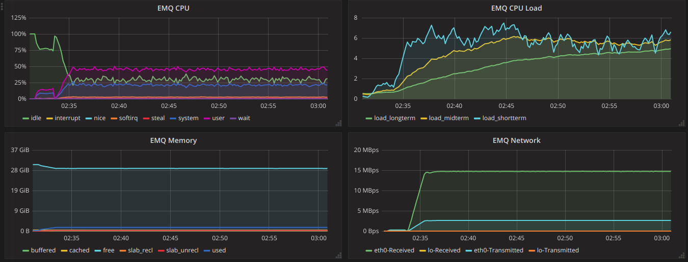

qos0-p1K-30K-0 system monitoring：

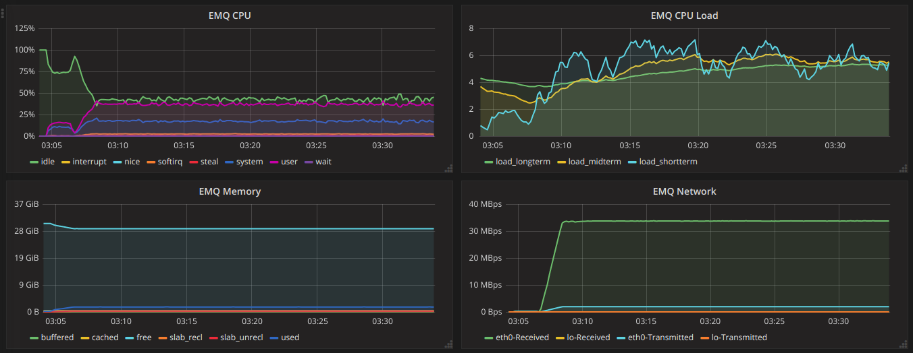

qos0-p10K-10K-0 system monitoring：

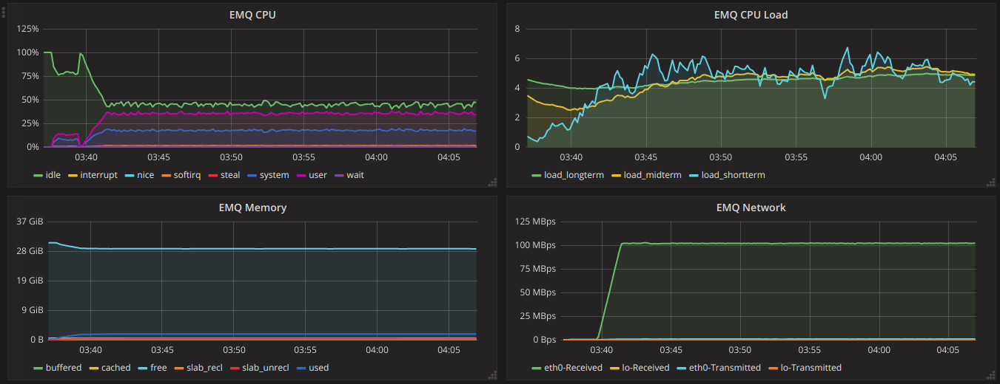

qos0-p100K-1K-0 system monitoring：

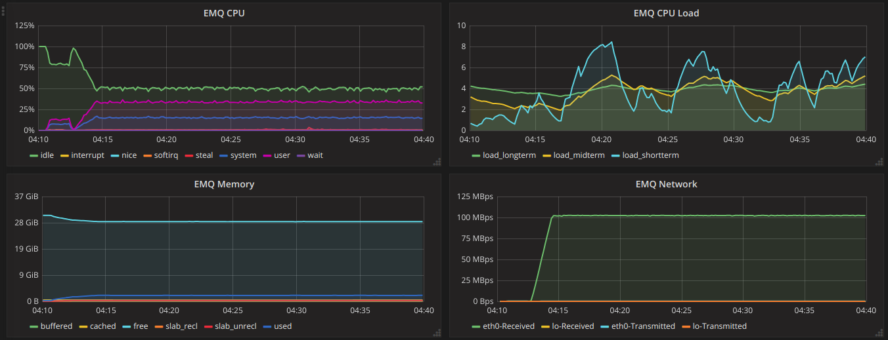

-------------------------------
QoS0 Fan-Out Message Throughput
-------------------------------

+-----------------+------+-----------+-------------------------+--------------------------+------------------+-----------------------+
|  Scenario ID    | QoS  |  Payload  | PUB Connection X Fan-In | SUB Connection X Fan-Out | Fan-Out(Avg/Max) | Background Connection |
+=================+======+===========+=========================+==========================+==================+=======================+
| qos0-p256-4-40K | 0    | 256       |       4 X 1             |      10K X 4             | 36066            |            100K       |
+-----------------+------+-----------+-------------------------+--------------------------+------------------+-----------------------+
| qos0-p1K-3-30K  | 0    | 1K        |       3 X 1             |      10K X 3             | 28295            |            100K       |
+-----------------+------+-----------+-------------------------+--------------------------+------------------+-----------------------+
| qos0-p10K-1-10K | 0    | 10K       |       1 X 1             |      10K X 1             | 9167             |            100K       |
+-----------------+------+-----------+-------------------------+--------------------------+------------------+-----------------------+
| qos0-p100K-1-1K | 0    | 100K      |       1 X 1             |      1K X 1              | 997              |            100K       |
+-----------------+------+-----------+-------------------------+--------------------------+------------------+-----------------------+

System resource utilization report:

+-----------------+-------------------------+-------+-----------------------+-----------------+
|  Scenario ID    | Throughput(Avg/Max Bps) | Load  |  CPU(user/sys)        | Memory(Avg/Max) |
+=================+=========================+=======+=======================+=================+
| qos0-p256-4-40K |   _/24.08M              | 8     | Not more than 40%/17% |     4.32G       |
+-----------------+-------------------------+-------+-----------------------+-----------------+
| qos0-p1K-3-30K  |   _/42.80M              | 8     | Not more than 30%/15% |     3.53G       |
+-----------------+-------------------------+-------+-----------------------+-----------------+
| qos0-p10K-1-10K |   _/112.30M             | 5     | Not more than 20%/15% |     3.77G       |
+-----------------+-------------------------+-------+-----------------------+-----------------+
| qos0-p100K-1-1K |   _/106.00M             | 2     | Not more than 18%/10% |     2.98G       |
+-----------------+-------------------------+-------+-----------------------+-----------------+

qos0-p256-4-40K  system monitoring：

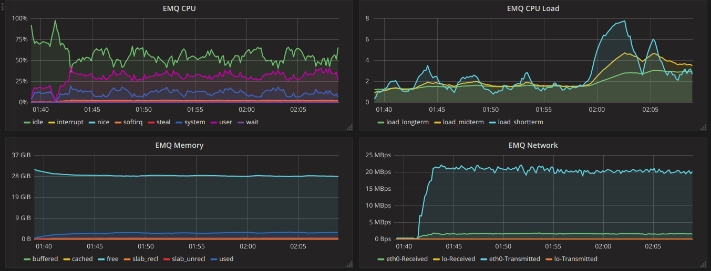

qos0-p1K-3-30K  system monitoring：

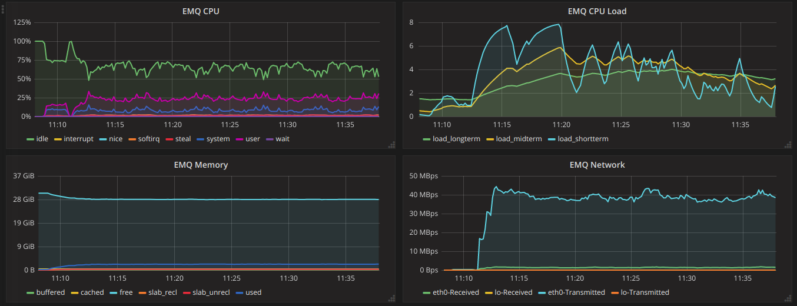

qos0-p10K-1-10K  system monitoring：

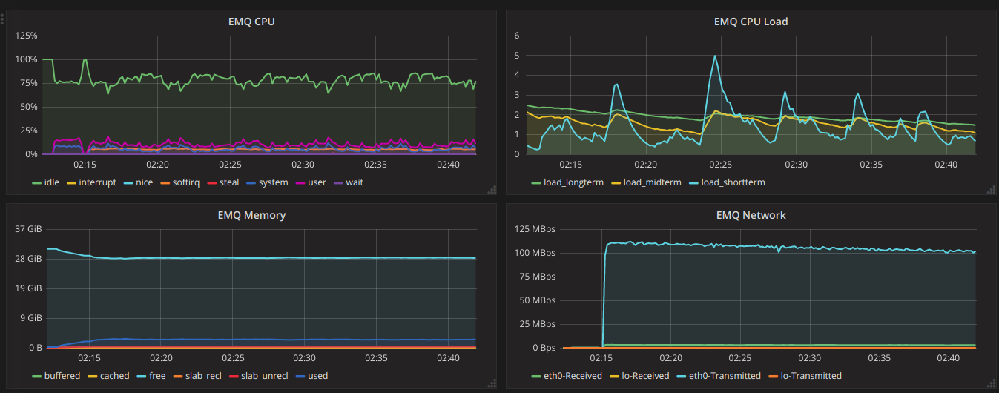

qos0-p100K-1-1K  system monitoring：

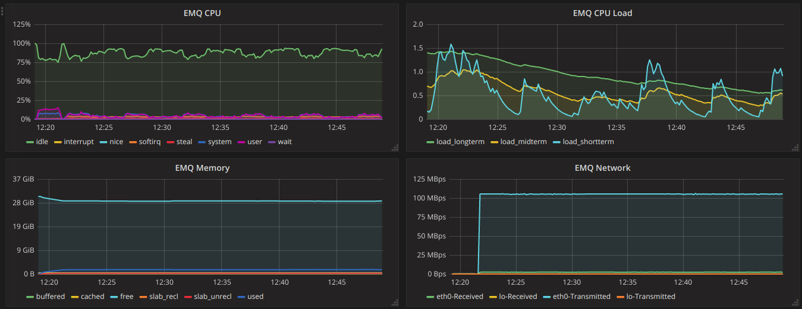

-------------------------------
QoS1 Fan-In Message Throughput
-------------------------------

+-----------------+-------+-----------+-------------------------+--------------------------+-------------------+-----------------------+
|  Scenario ID    |  QoS  |  Payload  | PUB Connection X Fan-In | SUB Connection X Fan-Out |  Fan-In(Avg/Max)  | Background Connection |
+=================+=======+===========+=========================+==========================+===================+=======================+
| qos1-p256-30K-0 | 1     | 256       |       3K X 10           |      0                   | 27475             |            100K       |
+-----------------+-------+-----------+-------------------------+--------------------------+-------------------+-----------------------+
| qos1-p1K-20K-0  | 1     | 1K        |       2K X 10           |      0                   | 18279             |            100K       |
+-----------------+-------+-----------+-------------------------+--------------------------+-------------------+-----------------------+
| qos1-p10K-5K-0  | 1     | 10K       |       1K X 5            |      0                   | 4724              |            100K       |
+-----------------+-------+-----------+-------------------------+--------------------------+-------------------+-----------------------+

System resource utilization report:

+-----------------+-------------------------+-------+-----------------------+-----------------+
|  Scenario ID    | Throughput(Avg/Max Bps) | Load  | CPU(user/sys)         | Memory(Avg/Max) |
+=================+=========================+=======+=======================+=================+
| qos1-p256-30K-0 |   _/12.49M              | 8     | Not more than 50%/25% |     1.90G       |
+-----------------+-------------------------+-------+-----------------------+-----------------+
| qos1-p1K-20K-0  |   _/23.41M              | 6     | Not more than 35%/20% |     1.91G       |
+-----------------+-------------------------+-------+-----------------------+-----------------+
| qos1-p10K-5K-0  |   _/50.16M              | 5     | Not more than 25%/15% |     1.90G       |
+-----------------+-------------------------+-------+-----------------------+-----------------+

qos1-p256-30K-0 system monitoring：

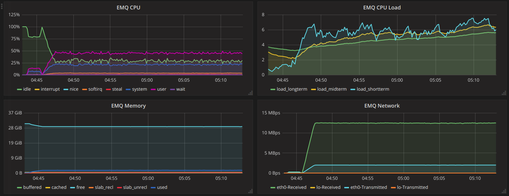

qos1-p1K-20K-0 system monitoring：

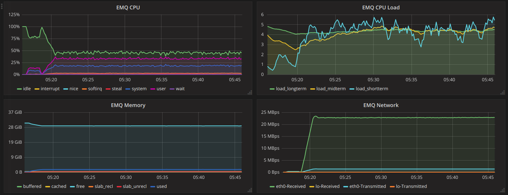

qos1-p10K-5K-0 system monitoring：

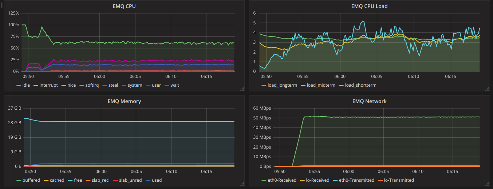

-------------------------------
QoS1 Fan-Out Message Throughput
-------------------------------

+-----------------+-------+---------+-------------------------+--------------------------+-------------------+-----------------------+
|  Scenario ID    |  QoS  | Payload | PUB Connection X Fan-In | SUB Connection X Fan-Out | Fan-Out(Avg/Max)  | Background Connection |
+=================+=======+=========+=========================+==========================+===================+=======================+
| qos1-p256-4-40K | 1     | 256     |       4 X 1             |      10K X 4             | 33118             |            100K       |
+-----------------+-------+---------+-------------------------+--------------------------+-------------------+-----------------------+
| qos1-p1K-3-30K  | 1     | 1K      |       3 X 1             |      10K X 3             | 25272             |            100K       |
+-----------------+-------+---------+-------------------------+--------------------------+-------------------+-----------------------+
| qos1-p10k-1-5K  | 1     | 10K     |       1 X 1             |      5K X 1              | 4266              |            100K       |
+-----------------+-------+---------+-------------------------+--------------------------+-------------------+-----------------------+

System resource utilization report:

+-----------------+-------------------------+-------+-----------------------+-----------------+
|  Scenario ID    | Throughput(Avg/Max Bps) | Load  | CPU(user/sys)         | Memory(Avg/Max) |
+=================+=========================+=======+=======================+=================+
| qos1-p256-4-40K |   _/15.70M              | 8     | Not more than 60%/25% |     3.70G       |
+-----------------+-------------------------+-------+-----------------------+-----------------+
| qos1-p1k-3-30K  |   _/33.60M              | 8     | Not more than 52%/25% |     3.62G       |
+-----------------+-------------------------+-------+-----------------------+-----------------+
| qos1-p10k-1-5K  |   _/49.40M              | 5     | Not more than 30%/20% |     3.18G       |
+-----------------+-------------------------+-------+-----------------------+-----------------+

qos1-p256-4-40K  system monitoring：

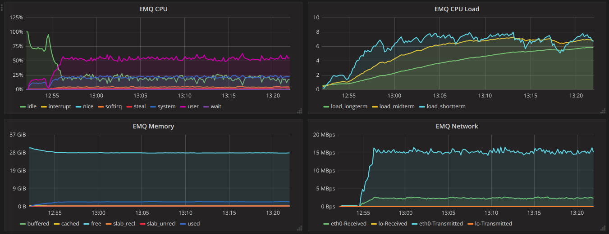

qos1-p1k-3-30K  system monitoring：

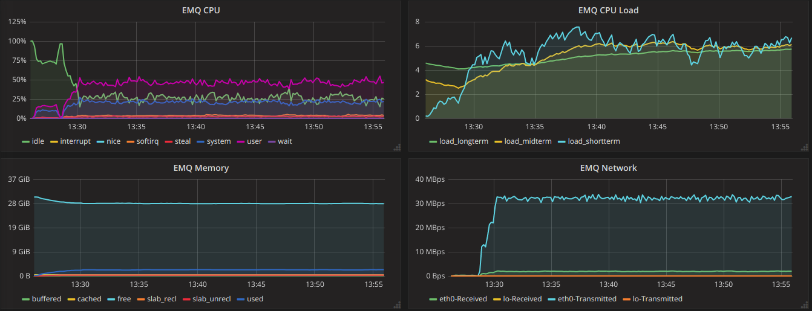

qos1-p10k-1-5K  system monitoring：

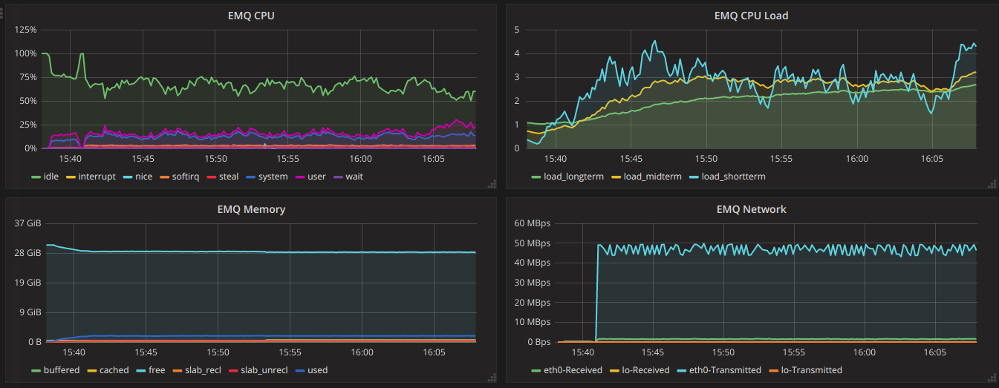

-------------------------------
QoS2 Fan-In Message Throughput
-------------------------------

+-----------------+-------+-----------+-------------------------+--------------------------+-----------------+-----------------------+
|  Scenario ID    |  QoS  |  Payload  | PUB Connection X Fan-In | SUB Connection X Fan-Out | Fan-In(Avg/Max) | Background Connection |
+=================+=======+===========+=========================+==========================+=================+=======================+
| qos2-p256-20K-0 | 2     | 256       |       4k X 5            |      0                   | 17514           |            100K       |
+-----------------+-------+-----------+-------------------------+--------------------------+-----------------+-----------------------+
| qos2-p1K-10K-0  | 2     | 1K        |       2k X 5            |      0                   | 9308            |            100K       |
+-----------------+-------+-----------+-------------------------+--------------------------+-----------------+-----------------------+
| qos2-p10K-3k-0  | 2     | 10K       |       600 X 5           |      0                   | 2845            |            100K       |
+-----------------+-------+-----------+-------------------------+--------------------------+-----------------+-----------------------+

System resource utilization report:

+-----------------+-------------------------+-------+-----------------------+-----------------+
|  Scenario ID    | Throughput(Avg/Max Bps) | Load  | CPU(user/sys)         | Memory(Avg/Max) |
+=================+=========================+=======+=======================+=================+
| qos2-p256-20K-0 |   _/10.88M              | 8     | Not more than 60%/26% |     2.02G       |
+-----------------+-------------------------+-------+-----------------------+-----------------+
| qos2-p1k-10K-0  |   _/13.18M              | 7     | Not more than 40%/22% |     1.89G       |
+-----------------+-------------------------+-------+-----------------------+-----------------+
| qos2-p10k-3k-0  |   _/31.37M              | 6     | Not more than 25%/15% |     1.84G       |
+-----------------+-------------------------+-------+-----------------------+-----------------+

qos2-p256-20K-0  system monitoring：

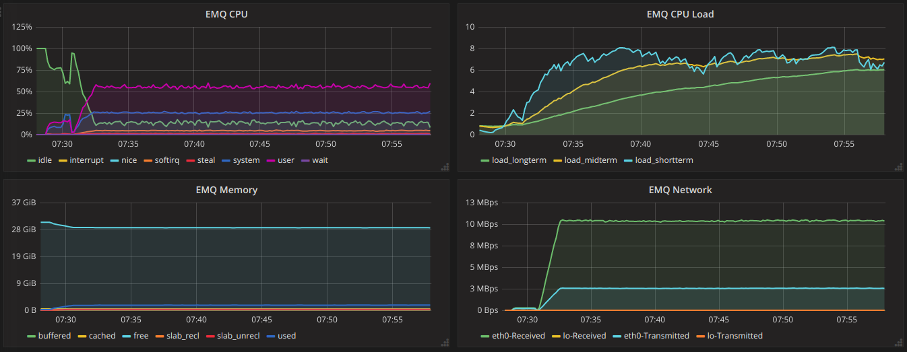

qos2-p1k-10K-0  system monitoring：

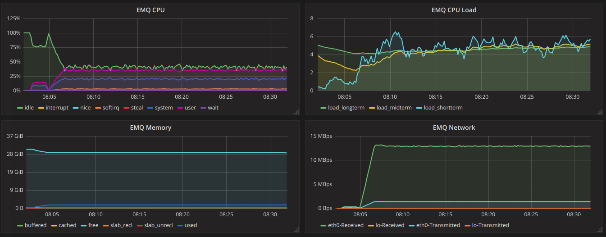

qos2-p10k-3K-0  system monitoring：

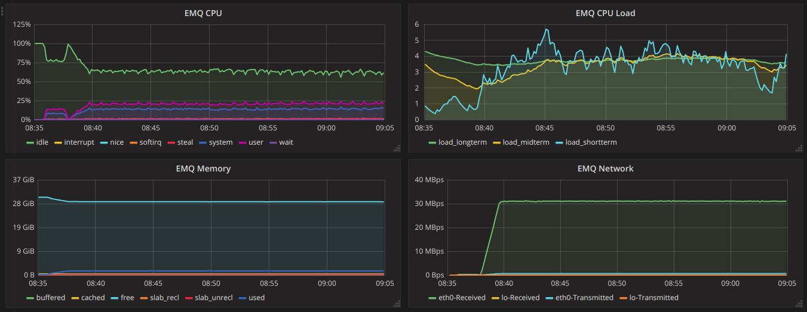

-------------------------------
QoS2 Fan-Out Message Throughput
-------------------------------

+--------------------------+-------+-----------+-------------------------+--------------------------+------------------+--------------------------+
|  Scenario ID             |  QoS  |  Payload  | PUB Connection X Fan-In | SUB Connection X Fan-Out | Fan-Out(Avg/Max) |  Background Connection   |
+==========================+=======+===========+=========================+==========================+==================+==========================+
|  qos2-p256-4-20K         | 2     | 256       |       4 X 1             |      5K X 4              | 14575            | 100K                     |
+--------------------------+-------+-----------+-------------------------+--------------------------+------------------+--------------------------+
|  qos2-p1K-2-10K          | 2     | 1K        |       2 X 1             |      5K X 2              | 7816             | 100K                     |
+--------------------------+-------+-----------+-------------------------+--------------------------+------------------+--------------------------+
|  qos2-p10K-1-1K          | 2     | 10K       |       1 X 1             |      1K X 1              | 926              | 100K                     |
+--------------------------+-------+-----------+-------------------------+--------------------------+------------------+--------------------------+

System resource utilization report:

+---------------------+-------------------------+-------+-----------------------+-----------------+
|  Scenario ID        | Throughput(RX / TX Bps) | Load  | CPU(user/sys)         | Memory(Avg/Max) |
+=====================+=========================+=======+=======================+=================+
| qos2-p256-4-20K     | _/9.95M                 | 7     | Not more than 50%/25% |     3.21G       |
+---------------------+-------------------------+-------+-----------------------+-----------------+
| qos2-p1k-2-10K      | _/13.05M                | 6     | Not more than 30%/20% |     3.22G       |
+---------------------+-------------------------+-------+-----------------------+-----------------+
| qos2-p10k-1-1K      | _/10.93M                | 3.2   | Not more than 17%/10% |     2.84G       |
+---------------------+-------------------------+-------+-----------------------+-----------------+

qos2-p256-4-20K  system monitoring：

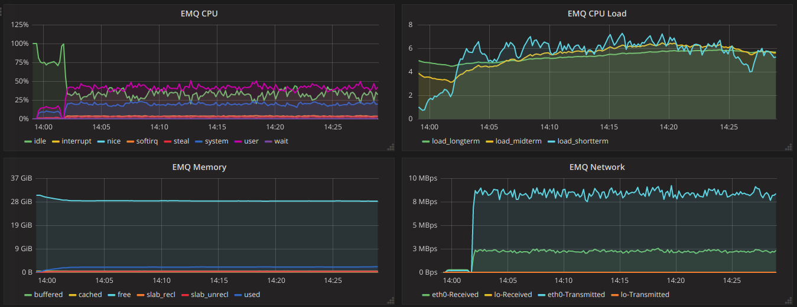

qos2-p1k-2-10K  system monitoring：

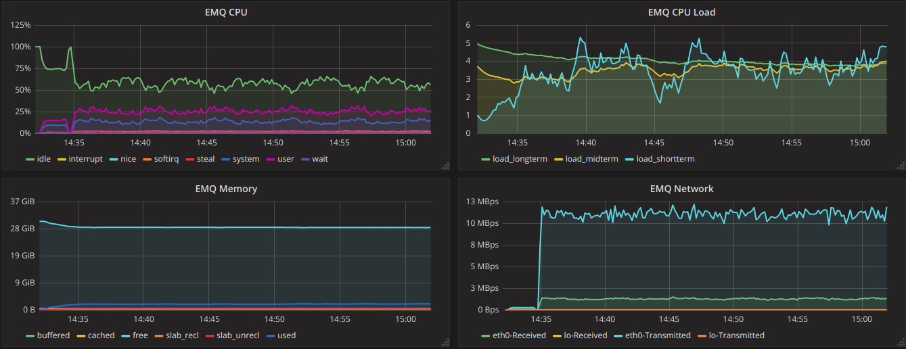

qos2-p10k-1-1K  system monitoring：

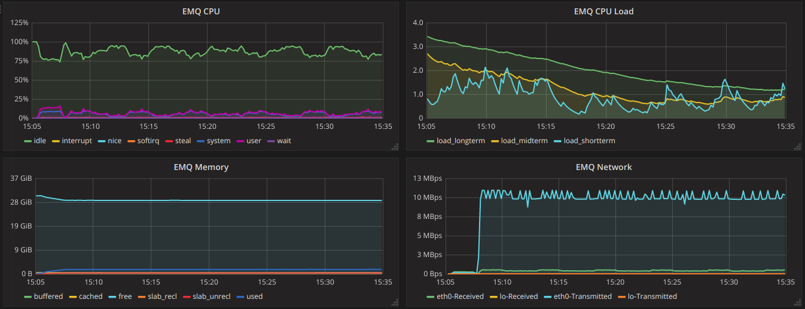

--------------------
Shared subscription
--------------------

Subscription Type: $queue/<topic> 或 $share/<group>/<topic>

+-------------------------+-------+-----------+-------------------------+--------------------------+---------------------+--------------------+-----------------------+
|  Scenario ID            |  QoS  |  Payload  | PUB Connection X Fan-In | SUB Connection X Fan-Out |  Fan-In (Avg/Max)   |  Fan-Out(Avg/Max)  | Background Connection |
+=========================+=======+===========+=========================+==========================+=====================+====================+=======================+
| qos0-p64-20K-20K        | 0     | 64        |       2K X 10           |      10 X 2K             | 19057               | 19051              | 100K                  |
+-------------------------+-------+-----------+-------------------------+--------------------------+---------------------+--------------------+-----------------------+
| qos0-p256-20K-20K       | 0     | 256       |       2K X 10           |      10 X 2K             | 19117               | 19112              | 100K                  |
+-------------------------+-------+-----------+-------------------------+--------------------------+---------------------+--------------------+-----------------------+
| qos1-p64-15K-15K        | 1     | 64        |       1.5K X 10         |      10 X 1.5K           | 13999               | 13996              | 100K                  |
+-------------------------+-------+-----------+-------------------------+--------------------------+---------------------+--------------------+-----------------------+
| qos1-p256-15K-15K       | 1     | 256       |       1.5K X 10         |      10 X 1.5K           | 13992               | 13953              | 100K                  |
+-------------------------+-------+-----------+-------------------------+--------------------------+---------------------+--------------------+-----------------------+
| qos2-p64-10K-10K        | 2     | 64        |       1K X 10           |      10 X 1K             | 9114                | 9112               | 100K                  |
+-------------------------+-------+-----------+-------------------------+--------------------------+---------------------+--------------------+-----------------------+
| qos2-p256-7K-7K         | 2     | 256       |       0.7K X 10         |      10 X 0.7K           | 6517                | 6516               | 100K                  |
+-------------------------+-------+-----------+-------------------------+--------------------------+---------------------+--------------------+-----------------------+

System resource utilization report:

+---------------------+-------------------------+-------+-----------------------+-----------------+
|  Scenario ID        | Throughput(RX / TX Bps) | Load  | CPU(user/sys)         | Memory(Avg/Max) |
+=====================+=========================+=======+=======================+=================+
| qos0-p64-20K-20K    |   4.84M/4.28M           | 7     | Not more than 55%/26% |      3.09G      |
+---------------------+-------------------------+-------+-----------------------+-----------------+
| qos0-p256-20K-20K   |   8.52M/8.07M           | 8     | Not more than 54%/25% |      3.00G      |
+---------------------+-------------------------+-------+-----------------------+-----------------+
| qos1-p64-15K-15K    |   4.52M/3.80M           | 8     | Not more than 56%/26% |      3.05G      |
+---------------------+-------------------------+-------+-----------------------+-----------------+
| qos1-p256-15K-15K   |   7.32M/6.61M           | 8     | Not more than 57%/26% |      3.07G      |
+---------------------+-------------------------+-------+-----------------------+-----------------+
| qos2-p64-10K-10K    |   4.68M/3.75M           | 8     | Not more than 60%/28% |      3.07G      |
+---------------------+-------------------------+-------+-----------------------+-----------------+
| qos2-p256-7K-7K     |   610k/477K             | 5     | Not more than 54%/26% |      4.78G      |
+---------------------+-------------------------+-------+-----------------------+-----------------+

qos0-p64-20K-20K system monitoring：

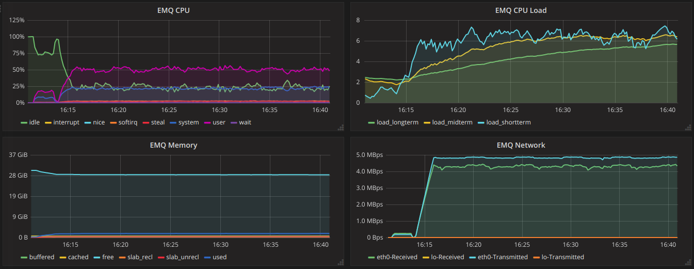

qos0-p256-20K-20K system monitoring：

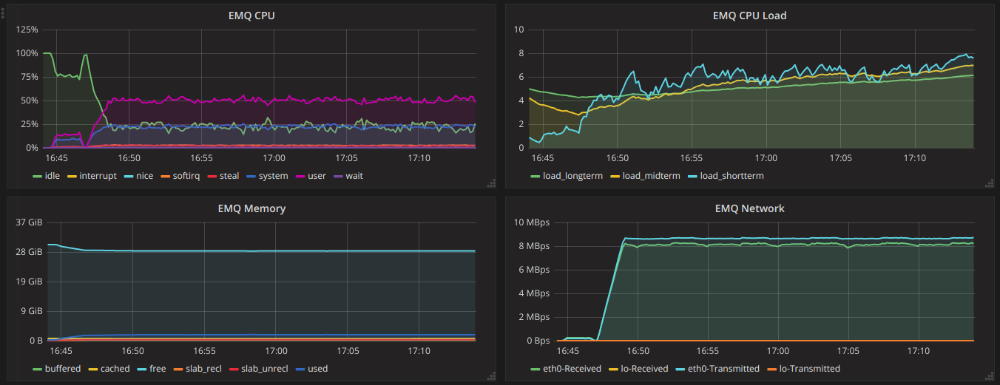

qos1-p64-15K-15K system monitoring：

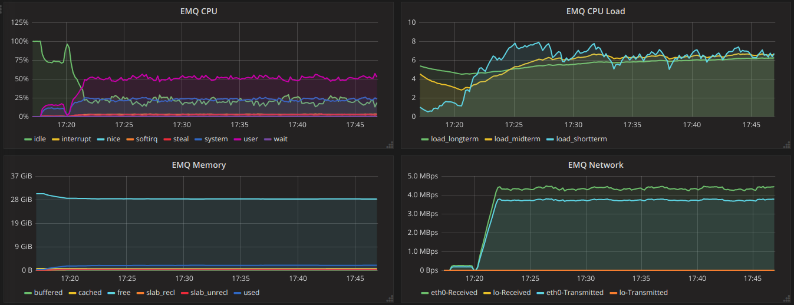

qos1-p256-15K-15K system monitoring：

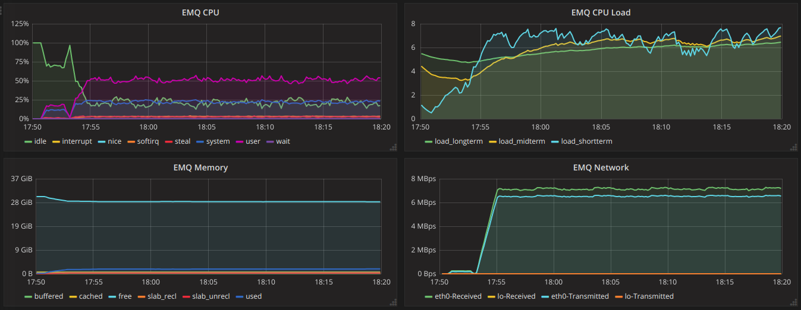

qos2-p64-10K-10K system monitoring：

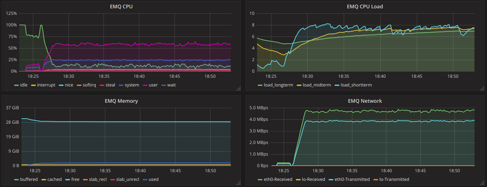

qos2-p256-7k-7K system monitoring：

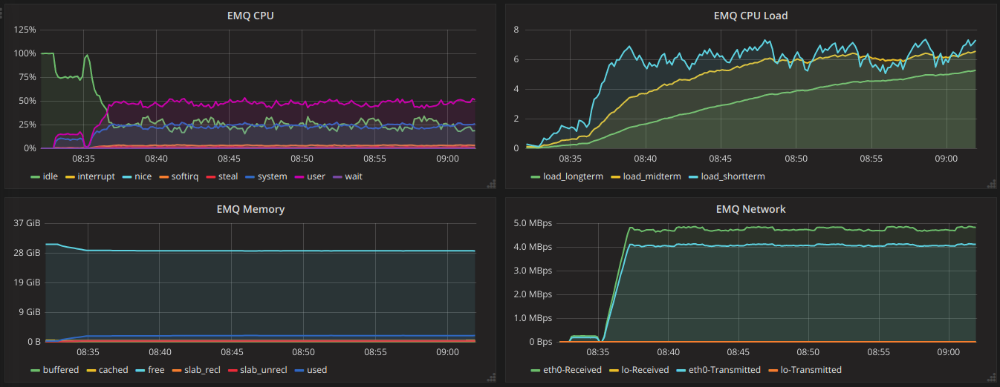
